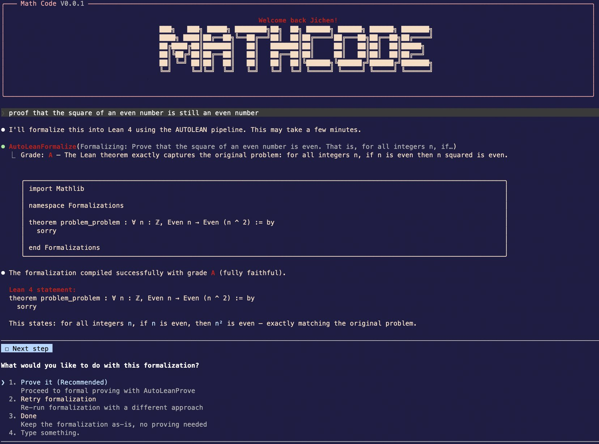

# MathCode

### MathCode: A Frontier Mathematical Coding Agent

```
███╗   ███╗ █████╗ ████████╗██╗  ██╗ ██████╗ ██████╗ ██████╗ ███████╗
████╗ ████║██╔══██╗╚══██╔══╝██║  ██║██╔════╝██╔═══██╗██╔══██╗██╔════╝
██╔████╔██║███████║   ██║   ███████║██║     ██║   ██║██║  ██║█████╗
██║╚██╔╝██║██╔══██║   ██║   ██╔══██║██║     ██║   ██║██║  ██║██╔══╝
██║ ╚═╝ ██║██║  ██║   ██║   ██║  ██║╚██████╗╚██████╔╝██████╔╝███████╗
╚═╝     ╚═╝╚═╝  ╚═╝   ╚═╝   ╚═╝  ╚═╝ ╚═════╝ ╚═════╝ ╚═════╝ ╚══════╝
```

**Project Page:** [math-ai-org/mathcode](https://github.com/math-ai-org/mathcode)

<p align="right"><strong>English</strong> | <a href="./README.ZH.md">中文</a></p>

MathCode is a terminal AI coding assistant with a built-in math formalization engine. Give it a math problem in plain language and it will automatically convert it into a Lean 4 theorem and attempt a formal proof.



## Quick Start

```bash
git clone https://github.com/math-ai-org/mathcode.git
cd mathcode
bash setup.sh
codex auth login
mathcode
```

`setup.sh` prepares the release checkout for daily use. It downloads or repairs
the bundled runtime, prepares local configuration, and installs a user-local
`mathcode` launcher for future shells.

If your current shell has not reloaded its profile yet, use `./run` as the
bundle-local fallback.

### Setup Responsibilities

Runtime files:

- downloads the matching `mathcode-vX.Y.Z-<os>-<arch>.tar.gz` asset when
  bundled runtime files are missing, stale, unverified, or invalid for the
  current platform
- restores `./mathcode`, `./mathcode-webui`, and `vendor/ripgrep/` from that
  archive when repair is needed
- verifies the current-platform `SHA256SUMS.txt` entry with `shasum` or
  `sha256sum`
- validates downloaded runtime files before replacing an existing working
  install
- records release metadata for the CLI and WebUI helper so later `setup.sh` and
  `setup.sh --status` runs can detect stale or unverified binaries

Local configuration:

- creates `.env` from `.env.example` when needed
- installs a managed user-local `mathcode` launcher in `~/.local/bin/` by
  default
- creates `skills/`, `tools/`, and `plugins/` extension directories
- ships a bundled `rg` binary under `vendor/ripgrep/` for MathCode's internal
  search paths

Lean toolchain:

- uses a complete bundle-local `.local/elan` Lean/Lake pair by default
- accepts `lean.exe` / `lake.exe` pairs from Git Bash/MSYS
- repairs partial local elan tool-file installs before bootstrapping the Lean
  workspace
- uses system Lean/Lake only when `MATHCODE_SETUP_USE_SYSTEM_LEAN=1` and both
  tools are available, preserving your existing `ELAN_HOME`

### Launcher And PATH Behavior

Setup only overwrites launcher files it previously created. This avoids
clobbering an unrelated existing `mathcode` command.

If `MATHCODE_INSTALL_BIN_DIR` is set, setup resolves relative paths against the
bundle root before writing the launcher, recorded state, or managed PATH block.
It also refreshes the managed profile block even when the chosen directory is
already on the current shell's `PATH`, so future shells keep resolving
`mathcode`.

If the selected launcher directory cannot be used, setup skips only the
launcher step and continues the rest of installation.

When `MATHCODE_SETUP_USE_SYSTEM_LEAN=1`, setup captures system `lean` and
`lake` before changing into the bundle root. Without that opt-in, `--status`
reports the default local `.local/elan` path instead of treating system Lean as
installed.

Generated `.env` path values are shell-quoted, so bundle paths containing
characters such as `$` or single quotes remain literal when `./run` sources the
file.

### Maintenance Commands

```bash
bash setup.sh --status   # check whether the binary/tooling look healthy
bash setup.sh --clean    # remove install artifacts, keep proofs/vault data
bash setup.sh --help     # show all setup flags
```

`setup.sh --status` checks that:

- `./mathcode --version` and checksum match this release tag's metadata
- `./mathcode-webui` matches the recorded release metadata
- the current platform's bundled `rg` is executable and reports a ripgrep
  version banner

`setup.sh --clean` preserves user outputs in `LeanFormalizations/` and vault
data. If setup previously recorded a managed launcher, later `--status` and
`--clean` runs keep tracking it even when `MATHCODE_INSTALL_BIN_DIR` is unset.

## Requirements

- macOS (arm64) or Linux (x86_64)
- `curl` for setup/bootstrap downloads
- `shasum` or `sha256sum` for release archive verification and metadata
- enough disk space for the bundle, Lean toolchain, and Mathlib caches
- `codex` CLI if you want the default backend and default math flow
- Python 3.12+ (optional, only needed for analysis tools in `tools/`)

## Common Commands

### CLI

```bash
mathcode -p "prove that the square of an even number is even"
echo "hello" | mathcode -p
mathcode --help
```

If you have not reloaded your shell yet, use the bundle-local fallback:

```bash
./run -p "prove that the square of an even number is even"
echo "hello" | ./run -p
./run --help
```

Math outputs are written to `LeanFormalizations/`.

### Browser UI

```bash
./run webui
```

`./run webui` sources the bundle `.env`, starts the local daemon, and prints the
browser authentication URL.

If launched directly, the packaged `./mathcode-webui` helper re-enters the
sibling `./run webui` wrapper first. Direct and wrapper launches therefore use
the same `.env`, local Lean toolchain, and bundle defaults. A present but
broken wrapper is reported as a launch failure.

### Goal And Command Limits

- `MATHCODE_GOAL_MAX_TOKEN_BUDGET` caps token budgets accepted by source
  `/goal`, `/goal` daemon commands, and `/api/v1/sessions/:id/goal`. It accepts
  the same positive integer, integer-valued decimal, and `k`/`m`/`b` compact
  formats as `/goal`; unset or invalid values fall back to `1000000000`.
- `MATHCODE_MAX_CHAINED_COMMAND_INPUTS` caps nested local slash-command
  next-input submissions before `QueryEngine` aborts. Unset or invalid values
  fall back to `25`.

### Goal Command Syntax

Interactive release sessions support:

- `/goal <token-budget> <objective>`
- `/goal --budget <token-budget>`
- `/goal --budget=<token-budget>`
- optional `--max-continuations N` or `--max-continuations=<N>`
- `/goal pause`, `/goal resume`, `/goal status`, and `/goal clear`
- bare `/goal`, `/goal help`, `/goal -h`, and `/goal --help`

The command continues the same session; it does not spawn a separate agent.
Objectives that begin with `/` are submitted as plain goal text, not parsed as
another slash command.

After a budget, `--help` can be the first objective token. Once objective
parsing has started, flag-looking tokens remain objective text unless a valid
later `--budget` is being used to supply the required explicit budget.

Invalid `--budget` values are rejected when `--budget` is parsed as the budget
option, including numeric-expression objectives like:

```text
1 + 1 ... --budget nope
```

### Model Effort

Use `--effort <level>` or interactive `/effort <level>` with `low`, `medium`,
`high`, `max`, or a positive integer; `/effort auto` and `/effort unset` return
the session to the model default.
For CLI model overrides, the reserved `default` value is matched
case-insensitively; custom model IDs keep their original casing.

### Custom Agents

Custom agent definitions trim `description`, JSON `prompt`, markdown prompt
bodies, `initialPrompt`, and JSON enum fields such as `effort`,
`permissionMode`, `memory`, and `isolation`; blank required
descriptions/prompts are rejected, and blank optional initial prompts are
ignored. JSON `skills` lists are normalized like markdown frontmatter.

### Session Diagnostics, Compaction, And Tasks

Interactive context displays keep diagnostic context intact:

- `/context` uses the same visible markdown transcript output in interactive and
  non-interactive sessions
- markdown table cells are escaped
- slash-command and deferred built-in tool details remain visible
- MCP loaded/available status is shown
- deferred categories are excluded from current-usage tables
- manual compact reserve is shown as reserved buffer
- free/reserved rows stay visible when current usage is empty
- malformed token rows and zero-token synthetic windows do not produce invalid
  suggestion percentages
- server-side and MCP tool blocks are counted in message breakdowns

Compact and autocompact paths:

- clamp malformed thresholds, token counts, legacy content shapes, and blank
  tool IDs
- preserve singleton tool-result pairs
- scope statusline, away summary, survey, and sticky-prompt UI to the active
  post-compact transcript
- suppress stale warnings after partial compact
- coalesce duplicate remote compacting statuses

Task handling:

- `/tasks`, `TaskStop`, and SDK `stop_task` do not count the selectable leader
  row as a running teammate
- pending remote agents and running in-process teammates can be stopped
- task tools and SDK `stop_task` trim task IDs
- deprecated `shell_id` and TaskOutput `agentId`/`bash_id` aliases can backfill
  blank `task_id` values
- legacy `wait_up_to` seconds are normalized
- legacy persisted task statuses are recovered across user-visible status shapes
- legacy `TaskUpdate` status aliases are accepted
- blank task text fields are rejected
- task metadata keys are trimmed, and blank or unsafe `__proto__` metadata keys
  are rejected
- TaskOutput timeouts must be integer-valued
- idle in-process teammate output is treated as ready instead of waiting for
  timeout
- mixed text/structured TaskOutput and TaskStop results replay correctly
- legacy TaskOutput output replay preserves tag-looking text such as `<error>`
- trimming command whitespace does not create false TaskStop truncation markers
- recently completed rows expire on schedule, while hidden summaries remain
  visible in very short terminals

Shell sleep auto-backgrounding and path validation recognize:

- decimal, suffixed, signed, exponent, and trailing-dot durations, such as
  `sleep 2s`, `sleep 2m`, `sleep +2`, and `sleep 2e0`
- wrapped shell forms such as `env ... sleep 2s`
- PowerShell quoted, commented, redirected, and module-qualified sleep commands,
  such as `& 'sleep' 2`, `Start-Sleep -Seconds:2 > $null`, and
  `Microsoft.PowerShell.Utility\Start-Sleep -Seconds 2`
- TimeSpan `-Duration` values, PowerShell parameter abbreviations and common
  parameters
- short, fractional, signed, and exponent `timeout` wrappers

## Features

### Persistent Lean REPL

Enable a persistent Lean language server for sub-second compile checks:

```env
MATHCODE_LEAN_REPL=1
```

After a one-time ~90s warmup (importing Mathlib), every subsequent compile
check takes **~0.4s** instead of ~30s.

Both error detection and pass confirmation are near-instant. The REPL
automatically imports your theorem library and axiom library.

### Theorem Library

Automatically store proved theorems for reuse in future proofs:

```bash
/theorem-store on     # enable (writes to .env)
/theorem-store off    # disable
/theorem-store sync   # backfill all proved-but-unstored theorems
/theorem-store status # show stored count and vault info
```

When enabled, every successfully proved theorem is automatically named,
appended to `TheoremLib/Stored.lean`, and made importable for future proofs.

The prover and planner can reuse stored theorems instead of re-deriving them.

### Axiom Library

Store conversational assumptions as persistent, consistency-checked declarations:

```bash
/axiomatize "A is faster than B"     # formalize + store
/axiomatize list                     # show all active axioms
/axiomatize check                    # consistency review
/axiomatize remove <name>            # remove a declaration
```

Axioms are stored per-vault with Lean formalization, compile-checked, and auto-injected into formalization and proving prompts. Supports any domain: math, physics, chemistry, narrative, general.

### Lean LSP Integration

Enable Lean LSP for smarter lemma discovery and structured error feedback during proving:

```env
MATHCODE_USE_LSP=1
```

When enabled, the prover:

- Searches leansearch.net and Loogle for verified Mathlib lemma names before planning
- Uses structured LSP diagnostics (line/col/severity) instead of raw stderr
- Extracts proof goal at error location for targeted repairs
- Injects search results and vault knowledge into planner and prover prompts

LSP is built-in — no separate installation required.

### Obsidian Theorem Graph

Generate an Obsidian vault that visualizes theorem dependencies as a knowledge graph:

```bash
/obsidian on       # enable + generate from existing formalizations
/obsidian off      # disable
/obsidian generate # regenerate now
```

When enabled, every formalization and proof auto-updates the vault. Open it in
Obsidian and use Graph View to see theorem-to-lemma relationships.

Each lemma stub includes the full Lean definition queried from Mathlib via
`#print`.

### Agent-Mode Proving

Each proof session becomes a full interactive chat where the agent uses tools to iteratively prove theorems:

```env
MATHCODE_AGENT_PROVE=1
```

Works best with Obsidian Theorem Graph enabled (the agent reads the vault for context). When enabled, the agent can:

- Search the vault for relevant Mathlib lemmas
- Write proof candidates and compile them via the persistent REPL
- Read compile errors, search for fixes, and recompile (up to 10 times per session)
- Stream its reasoning and tool calls in real-time

### Tree-of-Subgoals Proving

Decompose complex theorems into independent subgoals and prove them in parallel:

```env
MATHCODE_TREE_PROVE=1
MATHCODE_MAX_TREE_DEPTH=2    # recursion depth (default: 1)
```

The decomposer generates a skeleton with `have ... := by sorry` placeholders.
Each subgoal is proved independently, with cooperative cancellation if one
fails.

Proven bodies are stitched back into the skeleton and compile-checked.

### Multi-Planner

Run multiple planners in parallel to get diverse proof strategies:

```env
MATHCODE_NUM_PLANNERS=3
```

Each planner proposes a different strategy. All discovered lemmas are saved to the vault. The prover sees all plans and picks the best approach. Default is 1 (single planner).

### Scheduled Agent Loops

The bundled CLI ships with recurring prompt scheduling enabled out of the box.

Inside interactive MathCode sessions you can use:

```bash
/loop 10m check the deploy
/loop 1h /standup 1
```

Use short-lived loops for reminders and monitoring. When you want a schedule to survive restarts, create a durable schedule from the interactive session.

## Extensibility

MathCode supports three extension mechanisms:

### Skills (`skills/`)

Drop `.md` files to add domain-specific knowledge and proving strategies. Auto-discovered at startup.

### Tools (`tools/`)

Drop Python `.py` scripts with YAML frontmatter to add analysis tools. Auto-discovered at startup.

4 analysis tools are included: `axiom_checker`, `sorry_analyzer`, `proof_stats`, `lib_search`. Python 3.12+ is required only if you use these tools.

### Plugins (`plugins/`)

Drop plugin folders with `.mathcode-plugin/plugin.json` manifests to add commands, skills, agents, MCP servers, hooks, and more. Load via `--plugin-dir` or install from Git repos via `/plugin`.

## Backend Setup

### Default Codex/OpenAI Path

No `.env` edits are required for the default path.

```bash
codex auth login
mathcode
```

If you are still in the same shell where setup just finished, `./run` is the immediate fallback until you reload your shell profile.

To use an Anthropic-compatible backend instead, set:

```env
MATHCODE_USE_OPENAI=0

ANTHROPIC_API_KEY=sk-ant-...
ANTHROPIC_MODEL=claude-sonnet-4-5
```

To use an OpenAI-compatible backend such as **[Atlas Cloud](https://www.atlascloud.ai/?utm_source=github&utm_medium=link&utm_campaign=mathcode)** — a full-modal inference platform serving DeepSeek, Qwen, GLM, Kimi, MiniMax and more behind one OpenAI-compatible API (including the Responses API this route uses) — configure the OpenRouter route:

```env
MATHCODE_USE_OPENAI=0
MATHCODE_USE_OPENROUTER=1

OPENROUTER_API_KEY=your_atlascloud_api_key
OPENROUTER_BASE_URL=https://api.atlascloud.ai/v1
OPENROUTER_MODEL=deepseek-ai/deepseek-v4-pro
```

`deepseek-ai/deepseek-v4-pro` is a good default for the formalize/prove stages. Other common Atlas text/chat model IDs include:

- **Anthropic (Claude):** `anthropic/claude-haiku-4.5-20251001`, `anthropic/claude-opus-4.8`, `anthropic/claude-sonnet-4.6`
- **OpenAI (GPT):** `openai/gpt-5.4`, `openai/gpt-5.5`
- **Google (Gemini):** `google/gemini-3.1-flash-lite`, `google/gemini-3.1-pro-preview`, `google/gemini-3.5-flash`
- **xAI:** `xai/grok-4.3`

Atlas model availability changes over time; use the live Atlas model library or `GET https://api.atlascloud.ai/v1/models` to choose another text/chat model id.

If you also want the math tools to stop using `codex exec`, add:

```env
AUTOLEAN_USE_CODEX=0
```

Shell-exported environment variables override `.env`.

### WebUI Provider Keys

In the WebUI settings panel, provider-key rows are limited to secrets the
daemon can pass to real child sessions today: `anthropic` and `openrouter`.
Codex/OpenAI routes use Codex OAuth, not an `OPENAI_API_KEY` row.
WebUI `minimal` reasoning effort is preserved for OpenAI/OpenRouter routes and
maps to the CLI's lowest available `low` effort on Anthropic-compatible routes.

### Bundled Provider Dependencies

The release binary bundles the provider SDKs used by the Anthropic-compatible,
Bedrock, Vertex, and Foundry branches, plus the MCPB/DXT plugin package; these
routes do not require a source checkout's `node_modules`. Bedrock, Vertex, and
Foundry use their provider-specific credentials rather than
Anthropic-compatible `ANTHROPIC_AUTH_TOKEN` / `apiKeyHelper` bearer headers.

## FAQ

**Q: `mathcode` is not found right after setup**

Open a new shell, or run:

```bash
source ~/.zshrc
```

If you want to keep working immediately before reloading your shell, use:

```bash
./run
```

**Q: `./run` fails with `exec format error`, `Bad CPU type in executable`, or a similar startup error**

You probably downloaded the wrong binary for your platform. Re-run `bash setup.sh`, or download the correct release asset manually from GitHub Releases.

**Q: Startup says Codex auth is missing**

Run:

```bash
codex auth login
```

**Q: Can I skip cloning and just download a release asset**

Yes. You can download and extract the `.tar.gz` bundle from GitHub Releases
directly.

The archive is self-contained; `bash setup.sh` only downloads from GitHub when
bundled runtime files are missing, stale, or unverified. The bootstrap repo just
makes `bash setup.sh` the default path.

## Star History

Track the project's growth over time here:

[](https://www.star-history.com/#math-ai-org/mathcode&Date)

## Citation

If you use MathCode in research, please cite it as:

```bibtex
@misc{mathcode2026,
  title = {MathCode: A Frontier Mathematical Coding Agent},
  author = {Team Math-AI},
  journal = {math-ai-org.github.io},
  year = {2026},
  month = {April},
  url = "https://github.com/math-ai-org/mathcode"
}
```

## Community

Join our Discord for help, feedback, and discussion: **[discord.gg/f2AFP9W5](https://discord.gg/f2AFP9W5)**

## Acknowledgments

The math formalization and proving pipeline in MathCode is based on the [AUTOLEAN](https://github.com/T3S1AMAX/autolean.git) project.
